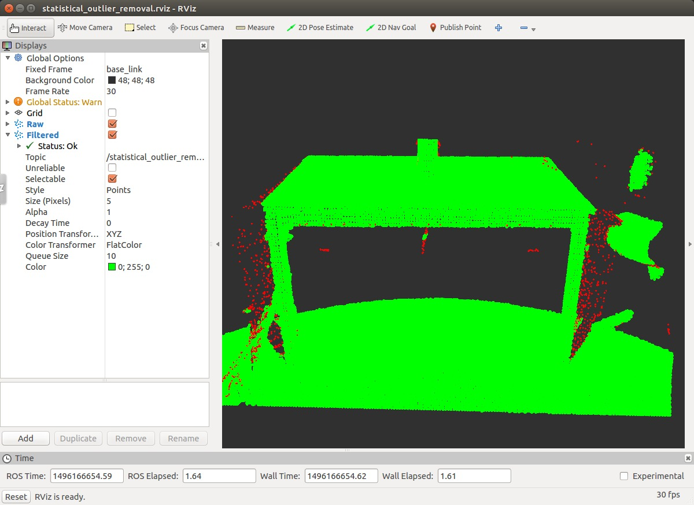

pcl/StatisticalOutlierRemoval
=============================

What is this?
-------------

StatisticalOutlierRemoval uses point neighborhood statistics to filter outlier data.

Publishing Topics
-----------------

.. include:: include/common_pub_topics.rst

Subscribing Topics
------------------

.. include:: include/common_sub_topics.rst

Parameters
----------

.. include:: include/common_params.rst

- ``~mean_k`` (float, default: ``0.01``, dynparam)

  The number of points (k) to use for mean distance estimation.

- ``~stddev`` (float, default: ``0.01``, dynparam)

  The standard deviation multiplier threshold. All points outside the mean +- sigma * std_mul will be considered outliers.

- ``~negative`` (bool, default: ``false``, dynparam)

  Set whether the inliers should be returned (true) or the outliers (false)

Sample
------

.. code-block:: bash

  roslaunch pcl_ros sample_statistical_outlier_removal.launch
