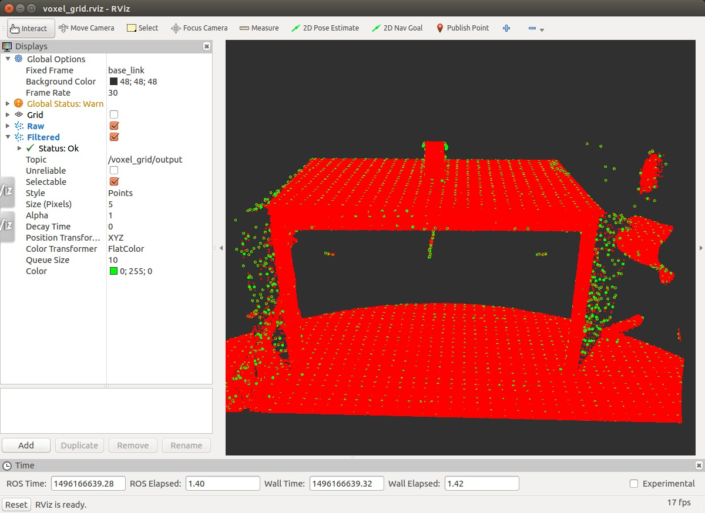

pcl/VoxelGrid
=============

What is this?
-------------

VoxelGrid assembles a local 3D grid over a given PointCloud,
and uses that to downsample the data.

Publishing Topics
-----------------

.. include:: include/common_pub_topics.rst

Subscribing Topics
------------------

.. include:: include/common_sub_topics.rst

Parameters
----------

.. include:: include/common_params.rst

- ``~filter_field_name`` (string, default: ``''``)

  Point field where point cloud is filtered.

- ``~leaf_size`` (float, default: ``0.01``, dynparam)

  The size of a leaf (on x,y,z) used for downsampling.

Sample
------

.. code-block:: bash

  roslaunch pcl_ros sample_voxel_grid.launch
